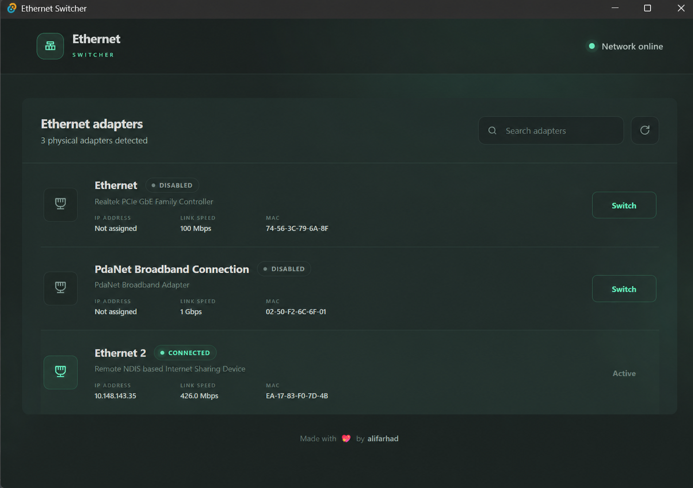

# Ethernet Switcher for Windows

A fast, lightweight Windows network adapter switcher. Enable one physical Ethernet connection and disable the others with a single click.

Useful if you regularly switch between built-in Ethernet, USB adapters, tethering devices, private networks, or multiple wired connections.



## Features

- Quickly switch between physical Ethernet adapters
- See connection status, IP address, link speed, and MAC address
- Automatically disable other wired adapters when switching
- Portable EXE and Windows installers available
- Runs locally without sending network information anywhere
- Clean interface with no setup or account required

## Download

Download the latest version from [GitHub Releases](https://github.com/ali-farhad/EthernetSwitcher/releases):

- `EthernetSwitcher-v1.0.0-Setup.exe` — standard Windows installer
- `EthernetSwitcher-v1.0.0.exe` — portable app, no installation needed
- `EthernetSwitcher-v1.0.0.msi` — MSI installer

Windows asks for administrator permission because enabling and disabling network adapters requires it. The app is not code-signed yet, so Windows SmartScreen may show a warning.

## How it works

The interface is plain HTML, CSS, and JavaScript inside a small Tauri app. A Rust backend uses built-in Windows PowerShell network commands to find, enable, and disable physical Ethernet adapters.

## Build a release

Push a version tag and GitHub Actions will build the portable EXE, setup EXE, and MSI automatically:

```powershell
git tag v1.0.0
git push origin v1.0.0
```

Made with 💖 by [alifarhad](https://github.com/ali-farhad).
